# Camp Planner - průvodce

*Průvodce odpovídá verzi Camp Planneru 0.3.1.*

Nástroj na plánování soustředění, táborů a podobných akcí složených z mnoha aktivit
běžících přes několik dní. Řeší tři věci:

* **časový plán aktivit**,
* **správu potřebného materiálu**,
* **správu TODO**,

vše včetně přiřazení organizátorů, tagů a dalších užitečných kategorizačních věcí.

*Ukázková data v této dokumentaci jsou polonáhodně vygenerovaná, viz [index.md](index.md).*

## Obsah

| Sekce | K čemu |
| --- | --- |
| [Slovníček](#slovníček) | co znamená aktivita, slot, org, garant, tag |
| [Quickstart](#quickstart) | od založení akce k první naplánované hře |
| [Režimy nasazení](#režimy-nasazení) | standalone, proxy, embedded |
| [Přihlášení a role](#přihlášení-a-role) | kdo co smí měnit |
| [Založení akce](#založení-akce) | délka, začátek dne, převzetí nastavení z loňska |
| [Rozvrh](#rozvrh) | plánování času, přesouvání bloků, obsazení orgy |
| [Detail aktivity](#detail-aktivity) | popis, materiál, úkoly, tagy, historie |
| [Seznam her](#seznam-her) | tabulka všeho, filtry a řazení, co ještě není hotové |
| [Materiál](#materiál) | co je potřeba sehnat a kolik toho |
| [Úkoly](#úkoly) | co zbývá udělat a do kdy |
| [Nastavení akce](#nastavení-akce) | kategorie, orgové, tagy, tokeny |
| [Google Kalendář](#google-kalendář) | obousměrné propojení s kalendářem |
| [Sklad](#sklad) | společný majetek napříč akcemi a inventury |
| [Světlý a tmavý režim](#světlý-a-tmavý-režim) | přepínač vzhledu |
| [API](#api) | strojový přístup k datům |

## Slovníček

| Pojem | Význam |
| --- | --- |
| Akce | jedno soustředění nebo tábor, všechno ostatní patří pod ni |
| Aktivita | hra, jídlo, přednáška; nese popis, materiál, úkoly a garanta |
| Slot | jeden časový blok, kdy aktivita běží; aktivita jich má libovolně (i žádný) |
| Org | člověk z pořadatelského týmu, v rozvrhu zkrácený na iniciály |
| Garant | org, který má aktivitu na starost |
| Pomocník | org, který garantovi s přípravou pomáhá |
| Účastníci slotu | orgové, kteří se konkrétního bloku skutečně fyzicky účastní (nemusí to být garanti) |
| Kategorie | barevné zařazení aktivity v rozvrhu |
| Tag | vlastní pole na aktivitě: hotovo/ne, postup, text nebo prosté označení |
| Okno dne | hodina, kterou začíná řádek dne v rozvrhu, výchozí 04:00 |
| Věc | kus majetku ve skladu, společný všem akcím; s počtem, jednotkou a fotkami |
| Krabice | místo, kde věci leží; každá věc je právě v jedné |
| Virtuální krabice | krabice, která je jen místem (například „Volně v polici A0“) |
| Vyřadit | věc už nemáme: zmizí z krabic, ale zůstane v historii a jde vrátit do skladu |
| Inventura | společná kontrola skladu, po dokončení se její zápisy propíší do věcí |
| Zápis | co inventura o jedné věci zjistila (stav sedí, jiný počet, vyřazení, přesun) |

## Quickstart

1. Admin založí akci (název, začátek, počet dní).
2. V **Nastavení akce** se vyplní kategorie, orgové a případně tagy.
3. V **Rozvrhu** (záložka *Timeline*) se v editačním módu dvojklikem vytvoří první slot
   a pojmenuje jeho aktivita.
4. V **detailu aktivity** se dopíše popis a přiřadí garant s pomocníky.
5. Přidá se materiál a úkoly. Průběžný stav je pak vidět v **Materiálu** a **Úkolech**.
6. Volitelně se akce propojí s Google Kalendářem.

## Režimy nasazení

Camp Planner může běžet v několika různých podobách podle typu začlenění do
jiných webů. Liší se to, o co se Camp Planner stará, odkud pochází identita
přihlášeného orga a co se vykresluje. Podrobnosti a návody jsou
v [DEPLOYMENT.md](DEPLOYMENT.md).

| Režim        | Identita                                | Přidělování práv           | Vykreslování                                                   | Světlé/tmavé téma           | Typické nasazení                   |
| ------------ | --------------------------------------- | -------------------------- | -------------------------------------------------------------- | --------------------------- | ---------------------------------- |
| `standalone` | vlastní účty a přihlašovací formulář    | v aplikaci (`/auth/users`) | celá stránka                                                   | in-app přepínač             | samostatná instalace               |
| `proxy`      | hlavičky `X-Remote-*` od reverzní proxy | hlavička `X-Remote-Roles`  | celá stránka                                                   | in-app přepínač             | vedle existující aplikace za nginx |
| `embedded`   | dodá hostitelská Flask aplikace         | hostitelská aplikace       | bloky do šablony: `content`, `cp_head`, `cp_scripts`, `cp_nav` | vynuceno hostitelským webem | planner vložený do většího webu    |

## Přihlášení a role

Role platí ve všech režimech nasazení stejně, liší se jen způsob přihlášení.

| Oblast                            | viewer | editor | admin |
| --------------------------------- | :----: | :----: | :---: |
| Prohlížení akce                   |   ✓    |   ✓    |   ✓   |
| Rozvrh, aktivity, materiál, úkoly |        |   ✓    |   ✓   |
| Kategorie, orgové, tagy           |        |   ✓    |   ✓   |
| Google Kalendář, API tokeny       |        |   ✓    |   ✓   |
| Název a slug akce                 |        |        |   ✓   |
| Zakládání akcí                    |        |        |   ✓   |
| Správa uživatelů                  |        |        |   ✓   |

`editor` a `viewer` se přidělují buď na konkrétní akci, nebo na všechny. Úvodní stránka
nabízí jen akce, ke kterým má přihlášený přístup.

## Založení akce

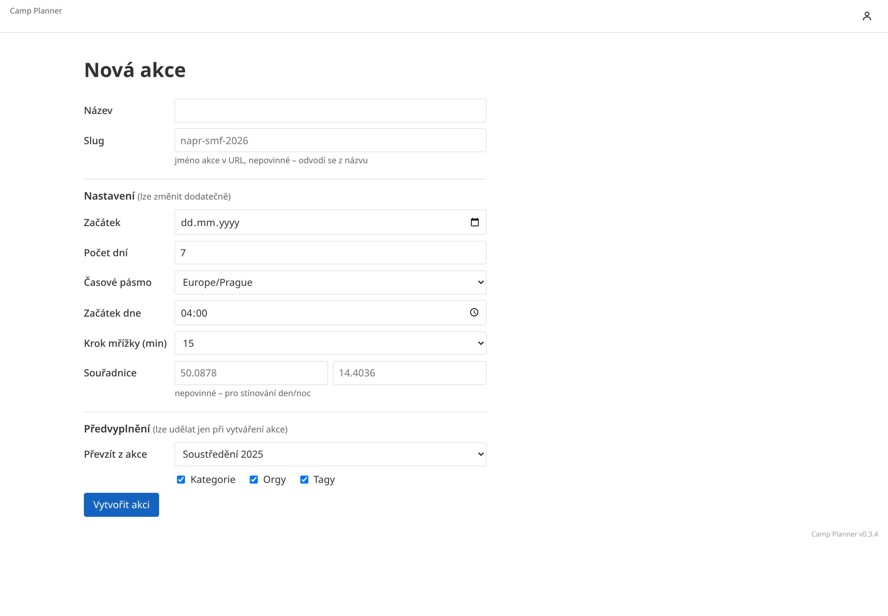

Povinný je jen název, ostatní se dá změnit i později.

* **Slug** – jméno akce v URL. Nevyplněný se odvodí z názvu.
* **Začátek dne** – hodina, kdy začíná řádek dne v rozvrhu. Výchozí 04:00 znamená, že
  noční program do půlnoci i po ní zůstane na řádku svého dne.
* **Krok mřížky** – na kolik minut zapadají tažené sloty.
* **Souřadnice** – nepovinné, jen kvůli stínování dne a noci v rozvrhu.
* **Převzít z akce** – zkopíruje kategorie, orgy a tagy z jiné akce. **Lze to
  jen při zakládání, později už ne**.

## Rozvrh

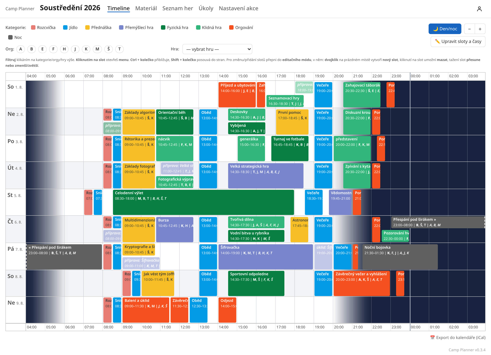

Hlavní obrazovka, v navigaci jako *Timeline*. Každý den je jeden 24hodinový řádek,
aktivity se můžou překrývat.

### Orientace

Řádek začíná v nastavenou hodinu (výchozí 04:00). Pozadí je stínované podle výšky slunce
(pokud má akce vyplněné souřadnice). Kliknutí na kategorii, orga nebo hru v hlavičce filtruje
zobrazení, tlačítka `+` a `−` mění přiblížení.

### Aktivity a sloty

* **Aktivita** je primární entita, se kterou se operuje – má popis, materiál, úkoly, garanta.
* **Slot** je jeden časový blok, kdy aktivita běží.

Jedna aktivita může mít slotů kolik chce, i žádný. Úpravy probíhají v **editačním módu**
(tlačítko *Upravit sloty a časy*): dvojklik na prázdné místo založí slot, tažení slot
posune nebo změní jeho délku, kliknutí umožní smazání. Změny se hromadí a ukládají se až
tlačítkem **Uložit**; odchod ze stránky s neuloženými změnami si vyžádá potvrzení.

### Klávesové zkratky

| Zkratka | Co udělá |
| --- | --- |
| `Ctrl` + kolečko | přiblížení a oddálení rozvrhu |
| `Ctrl+Z` | zpět, jen v editačním módu |
| `Ctrl+Y` nebo `Ctrl+Shift+Z` | vpřed |

### Víc slotů jedné aktivity

Přednáška, jídlo nebo rozcvička bývají jedna aktivita s mnoha sloty. Materiál a úkoly se
pak řeší jednou, ne osmkrát. Slot může mít vlastní název, který se zobrazí místo názvu
aktivity.

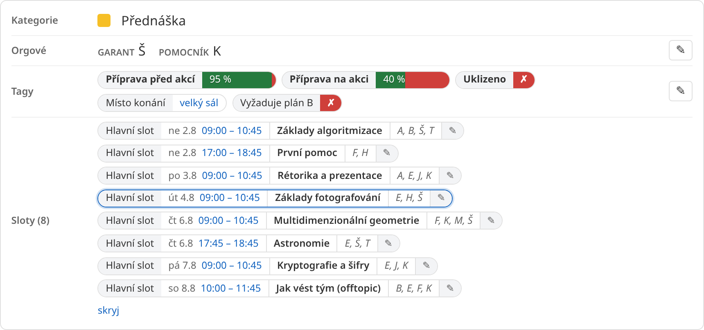

**Nový slot** k existující aktivitě se přidává v rozvrhu stejně jako nová
aktivita: dvojklikem na prázdné místo. V dialogu se pak vybere, jestli se založí
nová aktivita, nebo se slot přidá k již existující.

### Příprava a úklid

Slot má typ **hlavní slot**, **příprava** nebo **úklid**. Příprava a úklid se
v rozvrhu zobrazují poloprůhledně.

### Účastníci slotu

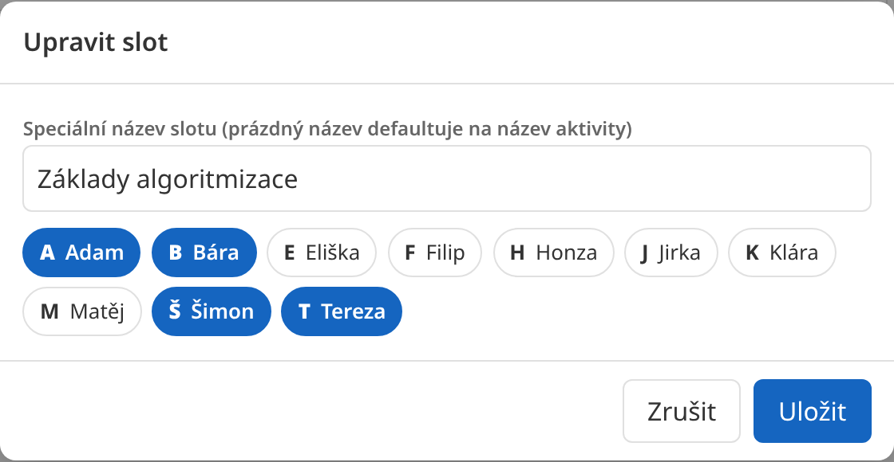

Orgové na slotu jsou něco jiného než garanti aktivity: garant hru vymýšlí a chystá,
na slotu fyzicky mohou být úplně jiní lidé. V rozvrhu se zobrazují jako iniciály.

### Programy přes půlnoc

Program, který skončí až po hodině začátku dne, se rozdělí mezi dva řádky. Navazující část
je označená šipkou na kraji, takže je poznat, že jde o jeden blok, ne o dva.

### Zásobník nenaplánovaných aktivit

Aktivita nemusí mít žádný slot. Takové hry čekají v seznamu her, až se pro ně najde místo.
Na rozvrh se dostanou v editačním módu: dvojklik na volné místo otevře dialog, kde záložka
**Přidat k existující** nabídne i aktivity zatím bez slotu.

### Souběžné úpravy

Rozvrh má verzi. Pokud ho mezitím změnil někdo jiný, uložení skončí chybou a je potřeba
načíst stránku znovu. Vlastní neuložené změny se tím ztratí, už uložené změny toho
druhého zůstávají.

## Detail aktivity

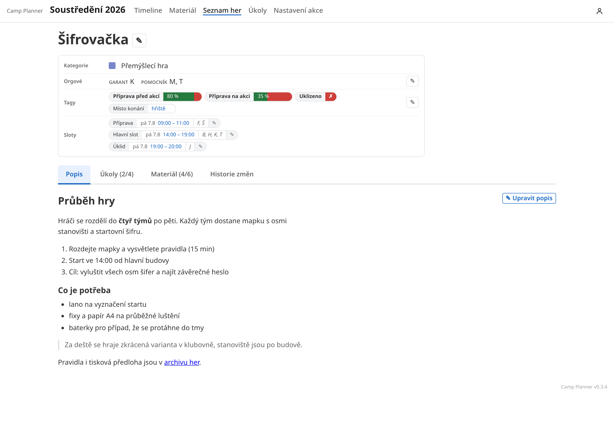

Vše k jedné aktivitě na jednom místě: kategorie, garanti a pomocníci, tagy, sloty a pod
tím záložky **Popis** (Markdown), **Úkoly**, **Materiál** a **Historie změn**. Počty
u záložek ukazují hotové z celkových.

### Historie změn

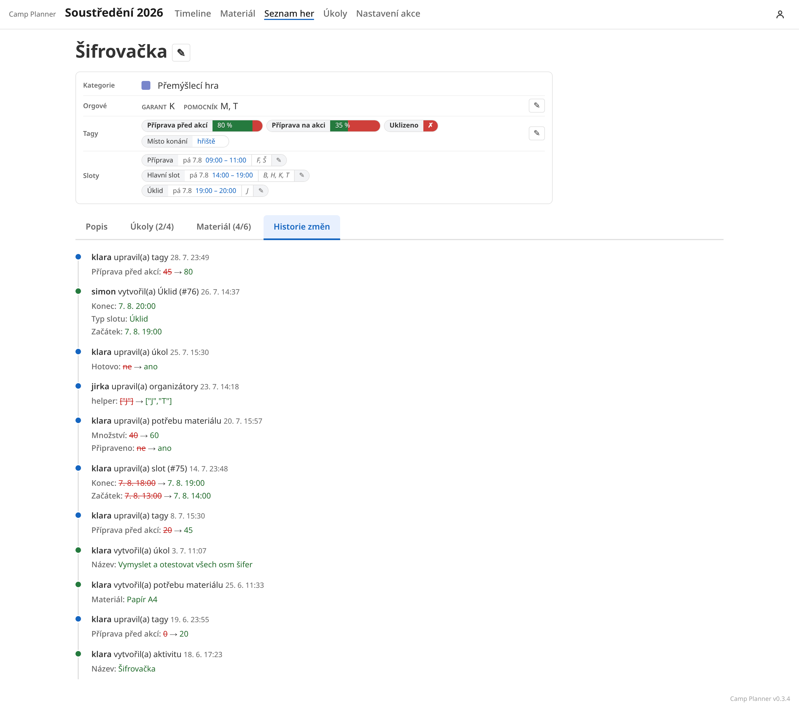

Záznam v historii se ukládá za každou změnu aktivity. U každého záznamu je
autor, čas a popis změny: stará hodnota škrtnutá červeně, nová zeleně. Sbírají se sem
i změny, které s aktivitou souvisejí nepřímo, tedy úpravy jejích slotů, úkolů, materiálu,
tagů i obsazení. Slot se pozná podle své role a čísla, například „Úklid (#76)“.

Čerstvé změny se datují relativně („před 3 dny“), starší přesným datem. Historie celé akce,
napříč všemi aktivitami, je na stejnojmenné záložce v nastavení akce.

## Seznam her

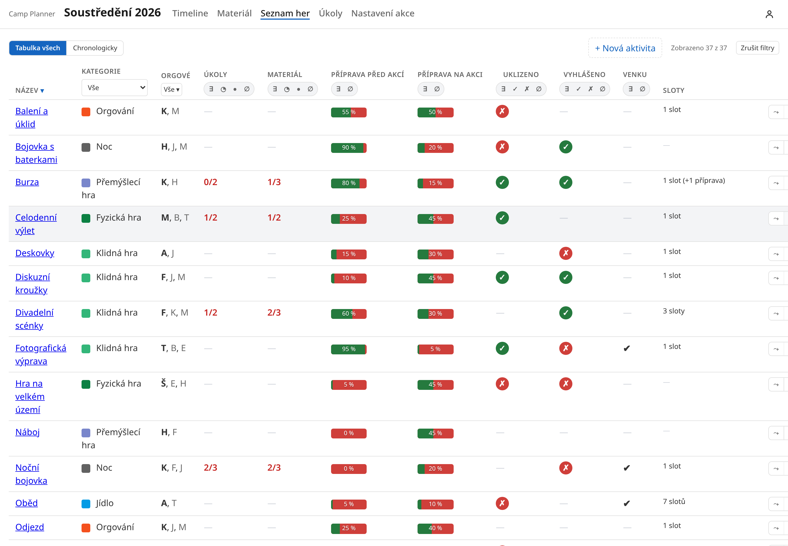

Tabulka všech aktivit. Připnuté tagy tvoří sloupce, takže se na jedné obrazovce dá projet,
co ještě není připravené. Sloupec **Sloty** shrnuje i přípravu a úklid.

Řazení i filtrování ovládají samotné hlavičky sloupců. Kliknutí na název sloupce podle něj
seřadí tabulku, druhé kliknutí pořadí obrátí (šipka ▾ / ▴ ukazuje směr). Pod názvem je
přepínač filtru, který se proklikává mezi stavy:

| Symbol | Vybere |
| --- | --- |
| `∃` | jen aktivity, které tag mají |
| `✓` | jen se zaškrtnutým tagem (jen u zaškrtávacích tagů) |
| `✗` | jen s nezaškrtnutým tagem (jen u zaškrtávacích tagů) |
| `∅` | jen aktivity bez tagu |

Stejný přepínač mají i sloupce **Úkoly** a **Materiál**, tam s dalšími stavy `◔` (něco
zbývá) a `●` (vše hotovo). Filtry se sčítají a **Zrušit filtry** je vypne najednou.
Nastavení řazení i filtrů se ukládá do adresy stránky, takže odkaz na konkrétní výběr jde
poslat dál nebo si ho uložit mezi záložky.

Přepínač nahoře nabízí druhý pohled, **Chronologicky**: tytéž aktivity seřazené podle času
konání a rozdělené po dnech.

Tlačítko **Nová aktivita** založí aktivitu bez slotu. Do rozvrhu ji lze později zařadit
z timeline.

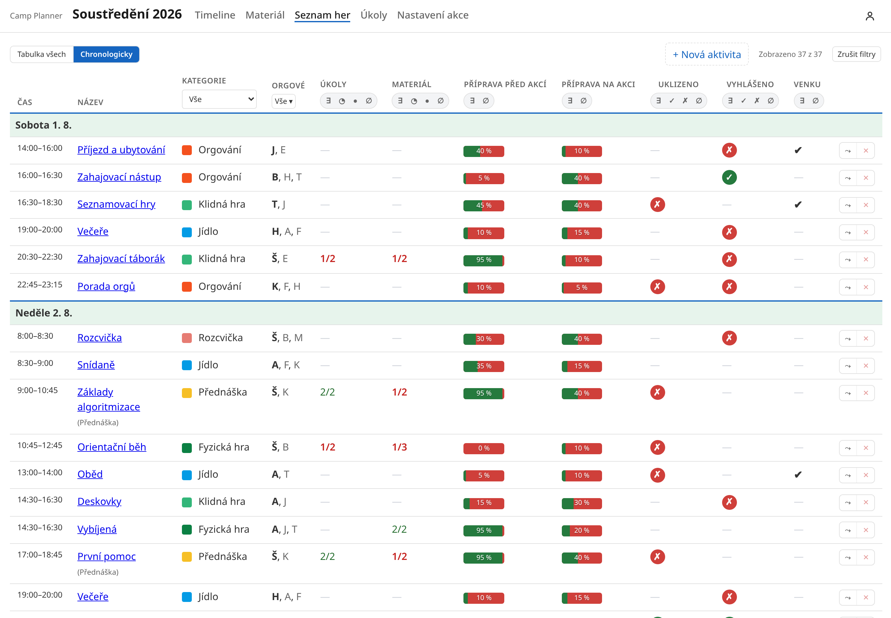

## Materiál

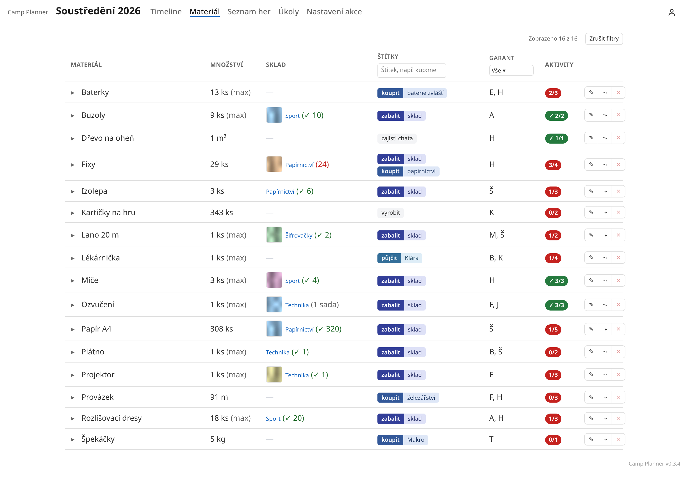

Dvě vrstvy: **katalog** akce (co existuje) a **potřeby** jednotlivých aktivit (kolik toho
kdo chce). Katalog hlídá duplicity, „papír A4“ a „A4 papír“ jsou jedna položka.

Způsob sčítání určuje strategie:

* **součet** pro spotřební věci – pět aktivit po 40 papírech je 200 papírů,
* **maximum** pro věci, které se půjčují dokola – tři aktivity potřebují projektor, ale
  stačí jeden.

Štítky pořízení ve tvaru `koupit: papírnictví` nebo `půjčit: Klára` říkají, odkud se věc
vezme, a u položky může být **garant**, který ji zajišťuje. Sloupec **Aktivity** počítá,
u kolika aktivit je materiál odbavený; zeleně, když u všech. Kliknutí na řádek ho rozbalí:
každá aktivita má vlastní řádek s množstvím pod součtem a zaškrtávátkem hotovo pod odznakem.

Pokud existuje v materiálech duplicita, dá se tlačítkem napravo **sloučit**
(pokud mají slučované materiály rozdílné jednotky, systém si postěžuje a sloučení
nepovolí – je potřeba je nejdřív srovnat a zkusit to znovu).

Materiál může být svázaný s věcí ve [skladu](#sklad). To se stane buď:

* Při zakládání materiálu z aktivity, kdy vyhledávač nabízí i věci ze skladu,
  společně s krabicí, ve které leží. Při výběru se založí materiál této akce
  se zkopírovaným názvem, odkazem a jednotkou.
* Existující materiál lze propojit při jeho editaci (lze vyhledat věc ve skladu,
  se kterou se propojí).

Na jednu věc ve skladu může odkazovat nejvýše jeden materiál z akce (aby se
zabránilo divným duplicitám).

Po propojení s věcí ve skladu ukazuje sloupec **Sklad** krabici a za ní v
závorce počet ve skladu, pokud je věc počítaná (zeleně když je věci dost,
červeně pokud ne, šedě když porovnat nejde). Odkaz na krabici ji otevře se
zvýrazněnou propojenou věcí. Pokud má věc fotku, je u ní zobrazena také.
Na detailu aktivity je také zobrazena fotka věci i odkaz na krabici (pokud
existuje).

## Úkoly

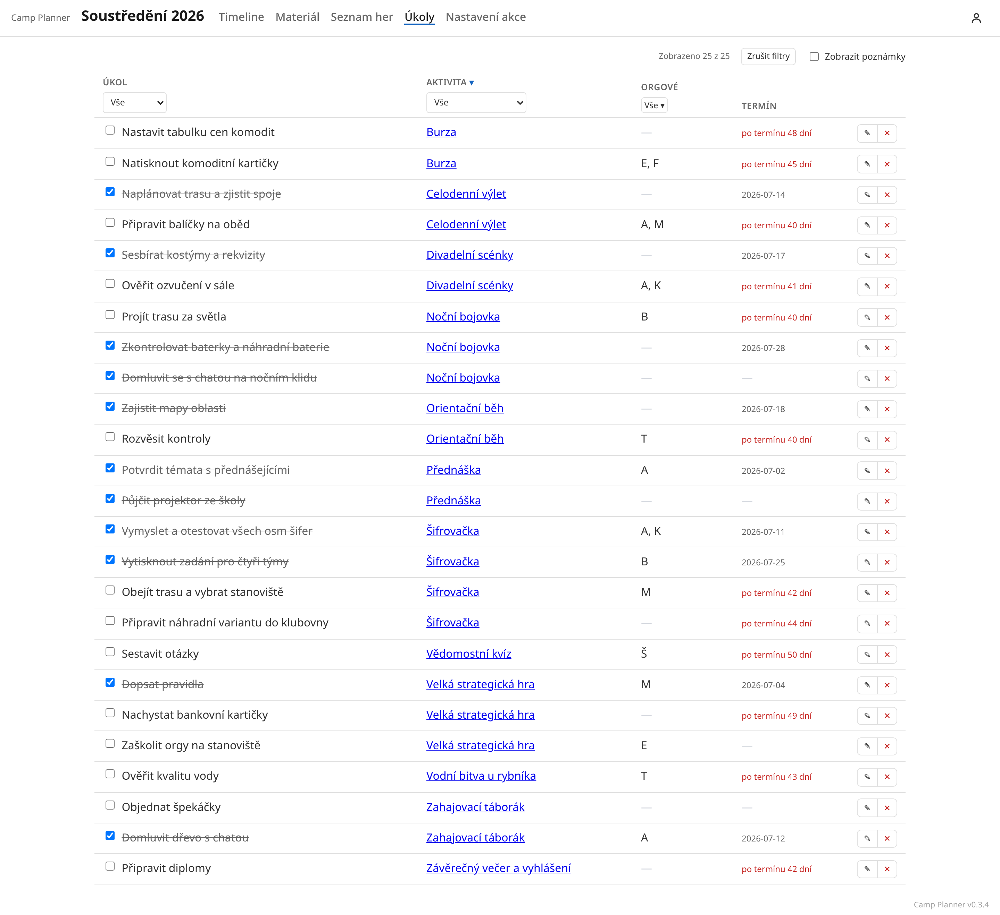

Úkoly patří vždycky k aktivitě, tady jsou přes celou akci pohromadě. Můžou mít termín
a přiřazené orgy. Termín se zobrazuje relativně, po termínu červeně.

## Nastavení akce

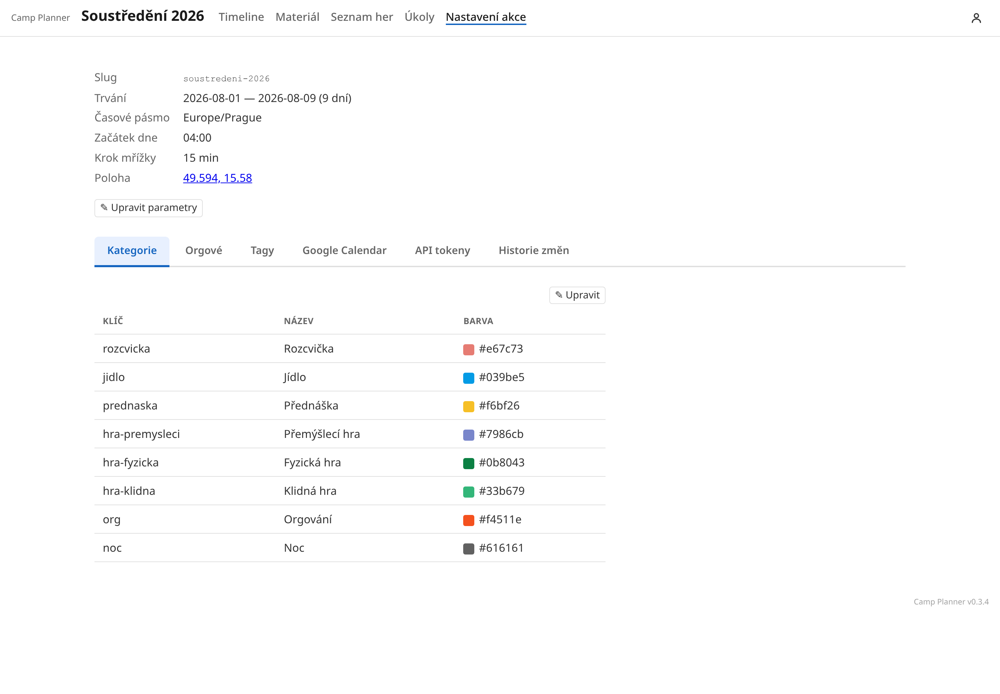

Záložky **Kategorie** (název a barva v rozvrhu), **Orgové** (jméno a iniciály), **Tagy**,
**Google Calendar**, **API tokeny** a **Historie změn** celé akce.

Tagy mají čtyři druhy podle toho, jakou nesou hodnotu:

| Druh | Hodnota | K čemu |
| --- | --- | --- |
| Štítek | žádná | prosté označení, třeba „Venku“ |
| Hotovo / ne | ano/ne | „Uklizeno“, „Vyhlášeno“ |
| Postup | 0–100 % | jak daleko je příprava |
| Text | libovolný | poznámka, třeba místo konání |

**Připnutý** tag se navíc zobrazí jako sloupec v seznamu her, takže si lze
přizpůsobit zobrazení podle potřeb akce.

## Google Kalendář

Propojení je nepovinné a funguje oběma směry:

**Ven** se posílá každá změna slotu: název aktivity (nebo vlastní název slotu), barva podle
kategorie, garanti v poli místa a účastníci slotu v popisu. Odesílání běží na pozadí
(potřebuje pravidelně spouštěný příkaz `sync-google`, typicky z cronu nebo systemd,
viz [DEPLOYMENT.md](DEPLOYMENT.md)), tlačítko *Synchronizovat nyní* ho spustí ručně.
*Znovu synchronizovat vše* opraví kalendář, pokud se s ním něco stalo.

**Dovnitř** nepřijde nic samo. *Načíst změny z Google* nabídne seznam rozdílů
k odsouhlasení, viz screenshot.

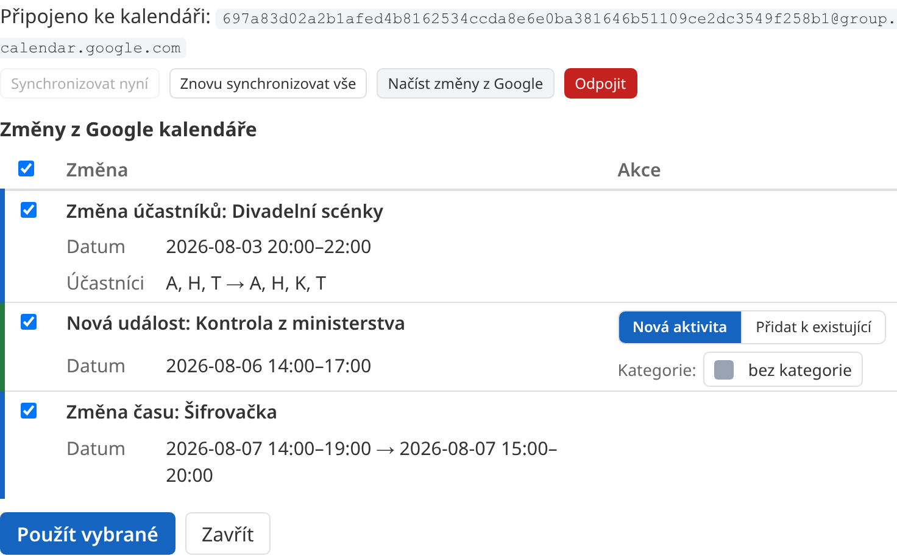

Rozpozná se posun času, změna účastníků, změna garantů i kategorie, smazané události a nové
události, které v plánovači nejsou. Ty lze importovat jako novou aktivitu, nebo je přidat
k existující. Bere se v úvahu jen okno akce, takže jeden kalendář unese víc akcí vedle
sebe. Iniciály se v události z Googlu poznají po rozdělení podle čárek, středníků,
plusů nebo mezer, závorky se ignorují.

Nastavení servisního účtu popisuje [google_calendar_setup.md](google_calendar_setup.md).

## Sklad

Sklad je společný pro všechny akce; odkaz na něj je na úvodní stránce v hlavičce.
Vidí do něj každý přihlášený, upravovat ho může editor aspoň jedné akce.

Věci bydlí v **krabicích**, každá věc právě v jedné (krabice může být i
virtuální, například „Volně v polici A0“, „Ztracené“ a podobně). **Přehled skladu**
je mapa krabic podle umístění: název krabice vede na její detail, klik jinam na
dlaždici ukáže náhled obsahu. Virtuální krabice se kreslí čárkovaně přes celý řádek.

V přehledu skladu se dá **fulltextově vyhledávat** v názvech věcí i krabic.
Hledání pak zobrazí jen věci nebo krabice, jejichž název vyhovuje vyhledávanému
výrazu. Podobné hledání je i v detailech krabic s větším počtem věcí.

U **věci** se eviduje nepovinný počet a jednotka. Prázdný počet může znamenat,
že věc existuje, ale počet neřešíme (typicky kusové věci), neurčité množství lze
zapsat do jednotky jako „hodně“, „nekonečno“ a podobně. Každá věc může mít dále
alternativní názvy pro hledání, odkaz (třeba na e-shop), poznámku a fotky. Věc
nemá vlastní stránku: na detailu krabice se tlačítkem ✎ otevře dialog s editací
(včetně přidání/odebrání fotek), kliknutím na počet s jednotkou se otevře jen
menší editační okno pro úpravu počtu.

S věcí se také dají udělat následující akce:

* **Přesunout** do jiné krabice.
* **Vyřadit** ze skladu. Vyřazená věc zmizí z krabic, zůstane ale ve složené
  sekci „Vyřazené“ na přehledu i ve všech inventurách. Odtud ji tlačítko
  **Vrátit do skladu** vrátí do vybrané krabice.
* **Smazat** nenávratně s kompletní historií. V tu chvíli zmizí ze všech
  inventur, odpojí se jakákoliv prolinkování a smažou se fotky. Typicky
  používané jen pro omylem založené věci.

### Inventura

Inventura je stav skladu k nějakému datu. Během aktivní inventury se celý sklad
přepne do speciálního módu, kdy orgové na detailech krabic u každé věci
zapisují její stav (ve výchozím stavu je vše na „nezkontrolováno“). Inventura se
pak tlačítkem **Dokončit inventuru** na stránce Inventury označí za dokončenou a
v tu chvíli se všechny zápisy propíší do stavu věcí. Dokončená inventura je
neměnná historie. Započatou inventuru lze i zrušit (**Zrušit inventuru** tamtéž),
v tu chvíli se všechny zápisy inventury zahodí.

Inventura se zahajuje na stránce **Inventury** a při zahajování lze zvolit
i existující akci pro zobrazení pomocného sloupce **Použito na …** s tím, kolik
které věci akce potřebovala (a tedy kolik se jich mělo vrátit nebo kolik se jich
asi spotřebovalo).
Nabídnou se jen akce, do kterých má zahajující přístup; číslo u věci pak vidí
každý, kdo vidí sklad.

Během inventury lze v detailu krabice o každé věci prohlásit:

* **stav sedí** – potvrdí se evidovaný počet,
* **jiný počet** – zapíše se skutečný počet (u počtu je pak vidět „15 → 12“),
* **vyřadit** – věc už neexistuje,
* **přesunout** – věc patří do jiné krabice,
* **nezkontrolováno** – výchozí stav (lze se do něj vrátit přes **zrušit kontrolu**).

K zápisu jde připsat poznámka, při dokončení se připojí na konec existující
poznámky u věci. Tlačítko **↝ Přesunout existující věc z jiné krabice** hledá v
celém skladu včetně vyřazených: nalezená věc se zobrazí v aktuální krabici
stejně, jako by se u věci kliknulo na „Přesunout“ (u vyřazené na „Vrátit do skladu“);
skutečně se přesune až s dokončením inventury.

Naráz běží jedna inventura, zapisovat může víc lidí zároveň; každá změna se ukládá
okamžitě. Počty, přesuny a vyřazování se během ní mění jen inventurními tlačítky,
ostatní úpravy věci fungují dál. Přepínač **skrýt zkontrolované** nechá v krabici jen to,
co zbývá projít. Průběh ukazuje přehled skladu: počet zkontrolovaných věcí u každé
krabice i za celé umístění, hotové krabice jsou podbarvené zeleně.

Staré inventury si lze prohlédnout jako celek, nebo lze na každé krabici použít
tlačítko **Historie**, které přidá sloupec za každou z posledních pěti inventur
(na telefonu tří), které o obsahu krabice něco říkají. Značky: ✓ beze změny,
„4 → 6“ změna počtu, ⤳ přesun, ✕ vyřazení, pomlčka v té inventuře nekontrolováno.

### Fotky

Fotky fungují, jen když je server na ně nastavený (viz [DEPLOYMENT.md](DEPLOYMENT.md));
jinak se ta část skladu nezobrazuje. Nahrávají se v dialogu věci, na mobilu nabídne
prohlížeč rovnou foťák. První fotka je titulní a zobrazuje se u věci v seznamech,
kliknutím se zvětší.

## Světlý a tmavý režim

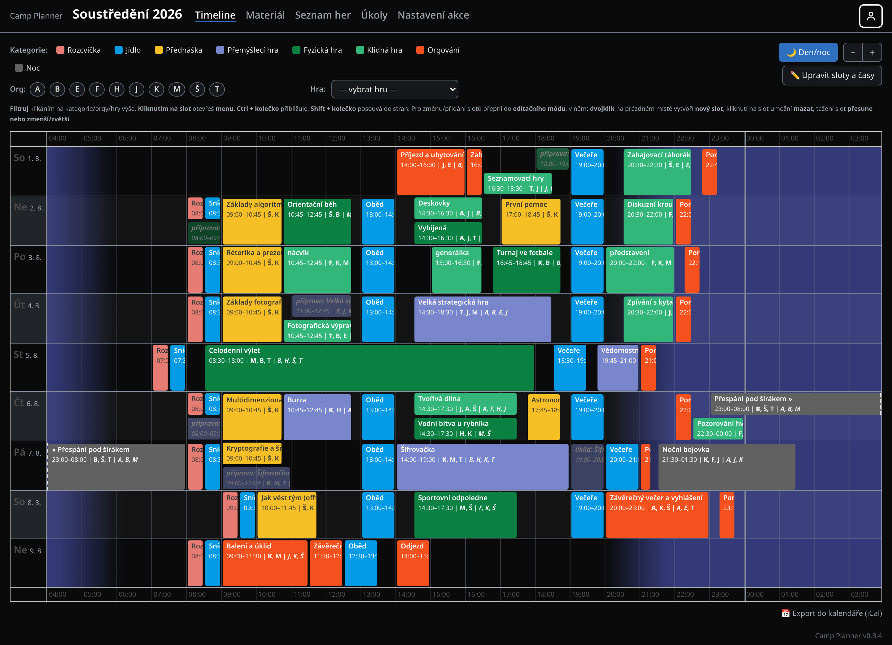

Přepínač má tři polohy: světlý mód, automaticky podle systému a tmavý mód. Ve
vlastním rozhraní Planneru je pod ikonkou účtu vpravo nahoře, ve vloženém režimu
sedí přímo v liště. Volba se pamatuje v prohlížeči. Planner vložený do cizího webu se
výchozím nastavením drží světlé varianty a přepínač zmizí, pokud si téma řídí
hostitelská stránka nebo je nastavené napevno.

## API

Vše, co umí web, umí i JSON REST API pod `/api`, dokumentace je na `/apidoc/swagger`.
Pro přístup zvenčí se v nastavení akce vydávají tokeny omezené na jednu akci a jednu roli.
Token se v plné podobě ukáže jen jednou, při vytvoření.
